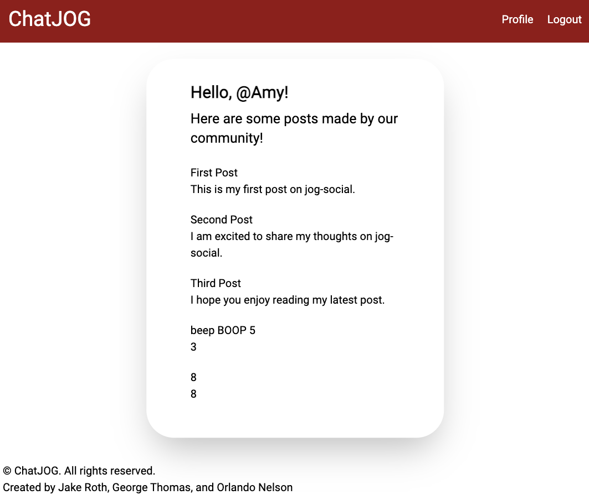

# ChatJOG

  

  ## Description
  ChatJOG is a social media application where users can create and respond to each others posts. Users are required to sign up and login to post and comment.

  ## Table of Contents
  - [Team](#Team)
  - [Thumbnail](#Thumbnail)
  - [Installation](#Installation)
  - [Usage](#Usage)
  - [License](#License)
  - [Contributing](#Contributing)
  - [Tests](#Tests)
  - [Questions](#Questions)
  
  ## Team
  - [George Thomas](https://github.com/gtgtcode)
  - [Orlando Nelson](https://github.com/nelson8223)
  - [Jake Roth](https://github.com/jakeroth0)

  ## Thumbnail
  

  ## Installation
  To install necessary dependencies, run the following command:

  ` npm i `

  ## Usage
  Update your .env file with your mysql password. Make sure that your mysql server is running and that you've dropped/created a database using the source schema.sql command. Once your db is set up you'll want to use npm run seed to add seeds to the db. Then you'll use npm run start to get the server up and running.

  ## License
  MIT
  Copyright 2023 jakeroth0

    Permission is hereby granted, free of charge, to any person obtaining a copy of this software and associated documentation files (the "Software"), to deal in the Software without restriction, including without limitation the rights to use, copy, modify, merge, publish, distribute, sublicense, and/or sell copies of the Software, and to permit persons to whom the Software is furnished to do so, subject to the following conditions:
    
    The above copyright notice and this permission notice shall be included in all copies or substantial portions of the Software.
    
    THE SOFTWARE IS PROVIDED "AS IS", WITHOUT WARRANTY OF ANY KIND, EXPRESS OR IMPLIED, INCLUDING BUT NOT LIMITED TO THE WARRANTIES OF MERCHANTABILITY, FITNESS FOR A PARTICULAR PURPOSE AND NONINFRINGEMENT. IN NO EVENT SHALL THE AUTHORS OR COPYRIGHT HOLDERS BE LIABLE FOR ANY CLAIM, DAMAGES OR OTHER LIABILITY, WHETHER IN AN ACTION OF CONTRACT, TORT OR OTHERWISE, ARISING FROM, OUT OF OR IN CONNECTION WITH THE SOFTWARE OR THE USE OR OTHER DEALINGS IN THE SOFTWARE.;

  ## Contributing
  make a pr

  ## Tests
  To run tests, run the following command:

  ` npm test `

  ## Questions
  If you have any questions about the repo, open an issue or contact me directly at jakeroth0@gmail.com. You can find more of my work on GitHub at [jakeroth0](https://github.com/jakeroth0).
